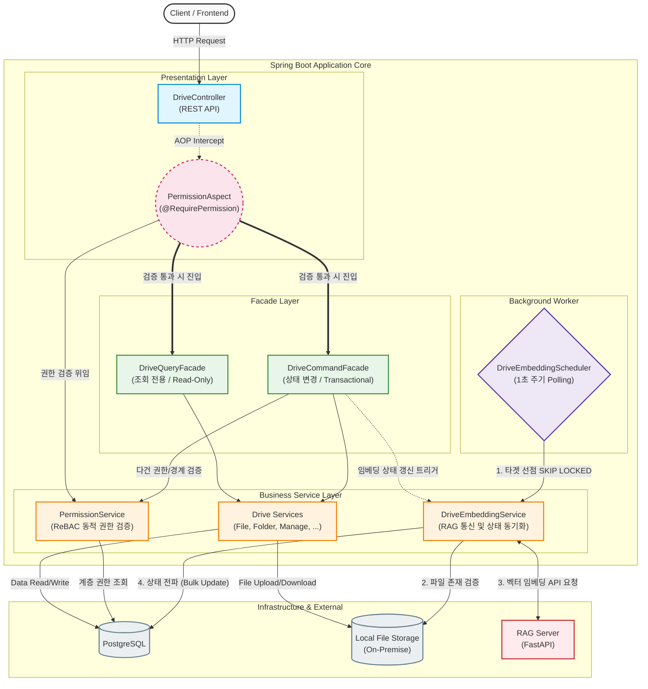
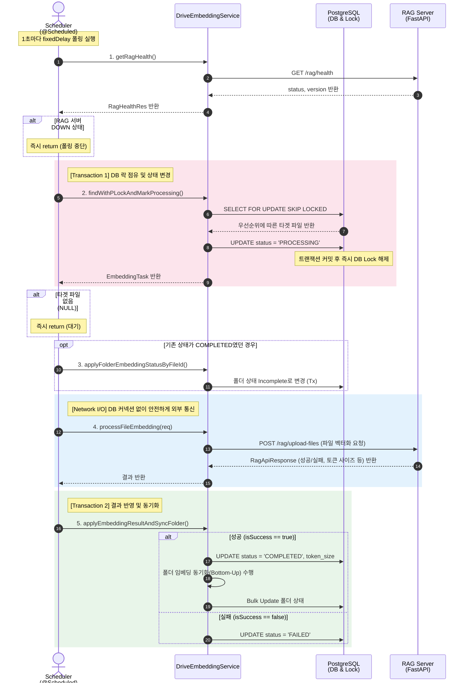
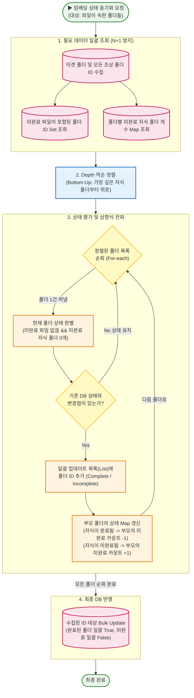
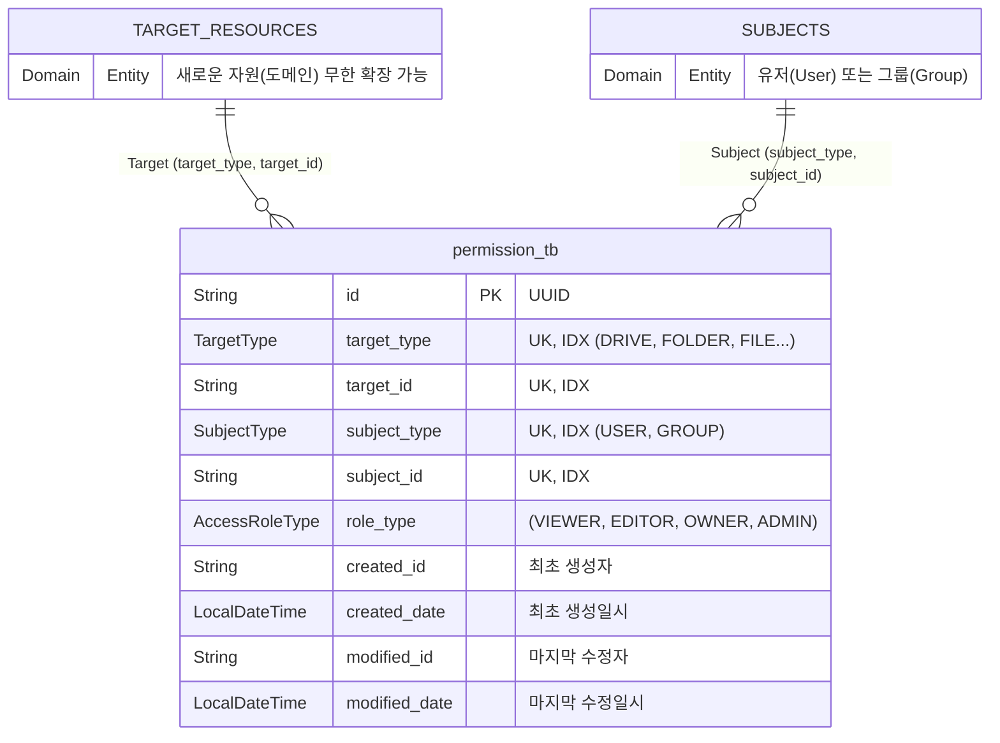
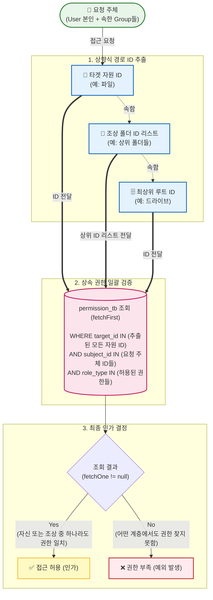
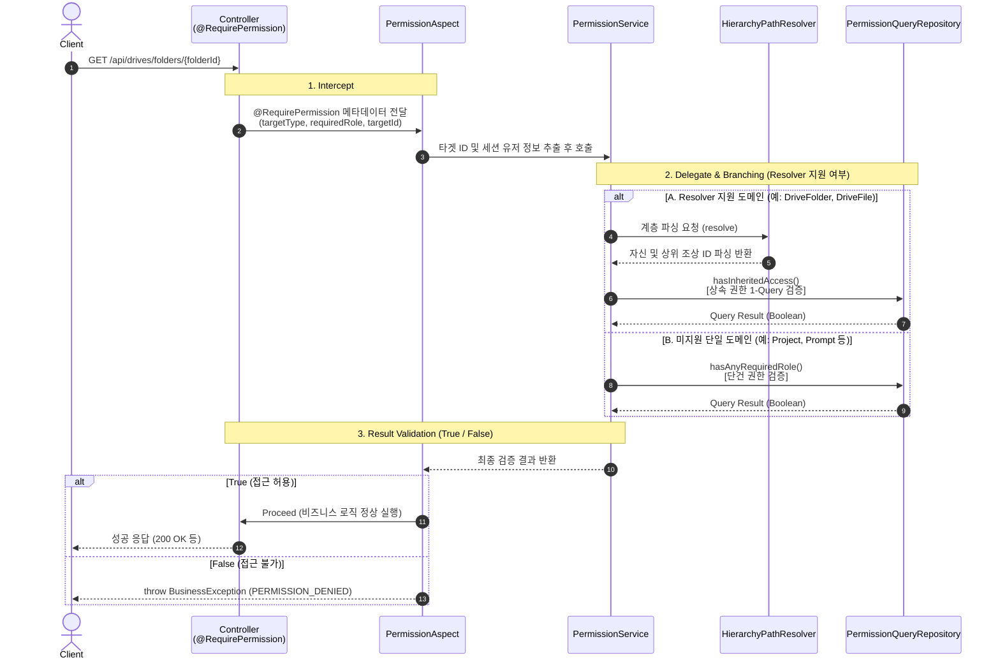

# 코어 시스템 아키텍처 설계 의도 및 특징 & 운영 가이드

## 0. 시스템 개요 및 아키텍처 흐름

**[시스템 아키텍처 다이어그램]**


**계층별 주요 역할**
- **Presentation Layer**: 클라이언트 요청을 수신하며, AOP(`@RequirePermission`)를 통해 비즈니스 로직 진입 전 단건 자원에 대한 권한을 검증합니다.

- **Facade Layer**: 여러 도메인 서비스(폴더, 파일, 권한 등)가 복합적으로 얽히는 작업의 트랜잭션 경계를 설정하고 오케스트레이션을 담당하여 서비스 간 순환 참조를 방지합니다.

- **Business Service Layer**: 드라이브 데이터 제어, 다형성 기반 권한 검증(ReBAC) 등 각 도메인의 핵심 비즈니스 로직을 처리합니다.

- **Background Worker**: RDB의 `SKIP LOCKED`를 활용해 대상을 선점하는 즉시 상태를 `PROCESSING`으로 변경하며 트랜잭션을 종료하고 벡터 임베딩을 동기로 요청합니다. 메인 스레드와는 분리된 단일 스레드에서 타겟을 한 건씩 조회하여 순차적으로 임베딩 파이프라인을 처리합니다.


<br>

## 1. 드라이브 시스템

### 1-1. 아키텍처 설계 및 트레이드오프
- **문제 인식:** 일반적인 부모-자식 ID 참조(Adjacency List) 방식은 하위/상위 폴더 전체 탐색 시 재귀 쿼리를 발생시켜 깊이가 깊어질수록 DB 부하가 커집니다.

- **해결책 (경로 열거 패턴 도입):** `DriveFolderEntity`에 `logicalPath` (예: `/uuidA/uuidB/uuidC/`) 컬럼을 도입하여 경로 열거(Path Enumeration) 패턴을 적용했습니다. 자기 자신의 UUID도 포함되며, 컬럼 길이 제한 및 성능을 고려해 최대 깊이는 `12`로 제한되어 있습니다.

- **조회 성능 향상:** 
  - 하위 자원 조회: `startsWith (LIKE '/uuid/.../%')` 연산과 PostgreSQL의 `varchar_pattern_ops` 인덱스를 결합하여 하위 폴더/파일 전체 조회를 인덱스 스캔을 탈 수 있는 1번의 쿼리로 최적화했습니다.

  - 상위 자원 조회: 엔티티의 `getAncestorIds()`를 통해 자기 자신을 포함한 모든 상위 폴더 ID를 어플리케이션 메모리 단에서 파싱하고, `IN` 절을 활용해 1번의 쿼리로 모든 조상 폴더들을 조회할 수 있습니다.

- **트레이드오프 관리 (Read vs Write):** - 폴더 이동(`moveFolders`) 시 하위 폴더들의 `logicalPath`를 일괄 수정해야 하는 쓰기 비용이 발생합니다. 하지만 드라이브 도메인 특성상 **쓰기(수정)보다 조회(탐색) 빈도가 높다는 점, 그리고 폴더와 파일은 상위 폴더, 소속 드라이브의 권한을 상속받기 위해 상위 자원들을 조회해야 하는 비즈니스 요구사항을 고려하여 트레이드오프를 선택**했습니다.

### 1-2. 대용량 데이터 쓰기 성능 및 정합성 보장
- **QueryDSL Bulk Update:** 폴더 이동(`moveItems`)이나 삭제(`deleteItems`) 등 하위 항목 전체에 대한 Update가 필요한 경우, JPA의 변경 감지가 아닌 QueryDSL 기반의 Bulk Update(`예: bulkUpdateDescendantsPathList`) 를 통해 성능 병목을 완화시켰습니다.

- **영속성 컨텍스트 관리:** Bulk 연산 수행 전 `em.flush()`로 보류된 쓰기를 동기화하고, 수행 후 `em.clear()`를 수행하여 1차 캐시와 DB 간의 데이터 불일치 문제를 예방하고 데이터 정합성을 보장하도록 했습니다.

### 1-3. Facade 아키텍처를 통한 트랜잭션 및 의존성 관리
- **문제 인식:** 폴더 이동, 파일 삭제, 권한 검증 등은 `DriveFolderService`, `DriveFileService`, `DrivePermissionService` 등 다수의 도메인 서비스가 복합적으로 얽히는 작업입니다. 이를 단일 서비스에서 모두 처리하려 할 경우, 비즈니스 로직의 전체적인 흐름을 따라가기 어려워지고 코드의 가독성이 저하되어 유지보수와 확장이 어려운 구조가 될 우려가 컸습니다.

- **해결책 (계층 분리 및 CQS):** 비즈니스 로직(Service)과 흐름 제어(Facade) 계층을 분리했습니다. 또한 데이터의 상태를 변경하는 `DriveCommandFacade`와 조회를 담당하는 `DriveQueryFacade`로 나누어 명령과 조회의 책임(CQS)을 논리적으로 분리했습니다.

- **트랜잭션 오케스트레이션:** 다중 도메인 서비스의 조합이 필요한 작업 시, Facade 계층의 메서드에서 트랜잭션의 시작과 끝을 제어합니다. 이를 통해 여러 작업을 하나의 논리적 트랜잭션(단일 작업 단위)으로 묶어 오케스트레이션함으로써 예외 발생 시 전체 롤백을 통한 정합성을 보장하도록 했습니다. (스프링 AOP 트랜잭션 기본 전파 옵션(`Propagation.REQUIRED`) 동작 원리에 따라, 하위 도메인 서비스의 트랜잭션은 분리되지 않고 Facade의 최상위 트랜잭션에 합류합니다.)

- **단일 책임 원칙:** Facade는 흐름 제어와 트랜잭션 경계 설정만 담당하고, 실제 비즈니스 로직은 하위 서비스로 위임하여 객체 지향적인 유연성과 단위 테스트 용이성을 향상 시켰습니다.

```text
[Presentation Layer]
DriveController (REST API)
 │
 ├── [Facade Layer : 트랜잭션 경계 & 비즈니스 오케스트레이션]
 │    │
 │    ├── DriveQueryFacade (조회 전용, @Transactional(readOnly = true))
 │    │    ├── DriveFolderService
 │    │    ├── DriveFileService
 │    │    ├── DriveRefService
 │    │    └── DriveManageService 
 │    │
 │    └── DriveCommandFacade (상태 변경 전용, @Transactional)
 │         ├── DrivePermissionService (권한 경계 및 유효성 검증)
 │         ├── DriveRefService (AI 문서 참조 토큰 발급 및 조회)
 │         ├── DriveManageService (드라이브 관리)
 │         ├── DriveFolderService (폴더 제어)
 │         ├── DriveFileService (파일 제어)
 │         └── DriveEmbeddingService (임베딩 상태 동기화)
 │
[Background Worker Layer : 스케줄링]
DriveEmbeddingScheduler (FOR UPDATE SKIP LOCKED 제어)
 └── DriveEmbeddingService (독립적인 트랜잭션으로 임베딩 처리)
```

### 1-4. DB와 물리 스토리지 간의 분산 환경 정합성 보장
- **커넥션 풀 고갈 및 이중 쓰기 방어:** 파일 업로드 같은 긴 네트워크 I/O 작업 시 DB 트랜잭션을 점유하면 커넥션 풀 고갈 장애가 발생할 수 있습니다. 이를 예방하기 위해 스토리지 업로드 로직과 DB 트랜잭션을 분리했습니다. 이로 인해 시스템 간의 원자성이 어긋나는 고아 파일 이슈를 제어해야 했습니다.

- **실행 순서 및 보상 트랜잭션:** 물리 스토리지에 먼저 업로드한 뒤 DB 트랜잭션을 수행하며, DB 트랜잭션 커밋 실패 시 스토리지의 파일을 삭제하는 **보상 트랜잭션** 로직을 통해 데이터 무결성을 보장할 수 있도록 했습니다.

### 1-5. 최상위 루트 설계 및 API 진입점 분리
본 시스템의 디렉토리 구조는 최상위 루트를 물리적인 폴더로 생성하지 않고, 식별자를 `folderId = null`로 취급하는 가상 루트 방식을 채택했습니다. 더불어 조회 및 생성 시, 내 드라이브(`/my-drive`), 공유 드라이브(`/shares`), 일반 폴더(`/folders`)로 API 진입점을 분리했습니다. 이 아키텍처는 다음과 같은 설계적 의도와 트레이드오프를 갖습니다.

**가상 루트 및 API 분리를 채택한 설계적 의도**
- **도메인 책임 분리와 데이터 중복 방지:** 최상위 루트의 메타데이터(`이름, 소유자 등`)는 이미 드라이브 본연의 속성입니다. 이를 최상위 폴더로 한 번 더 생성하는 것은 데이터 중복이라 판단하여, 드라이브(`컨테이너`)와 폴더(`내부 자원`)의 도메인 역할을 분리했습니다.

- **구조적 조작 차단:** 최상위 루트가 물리적 폴더로 존재할 경우, 요청 입력으로 이를 삭제, 이동, 이름 변경하려 할 때 이를 막기 위한 방어 로직(`depth == 0`)이 서비스 레이어 곳곳에 강제됩니다. 가상 루트 방식은 폴더 조작 API의 대상 자체가 되지 않으므로 이러한 리스크를 사전에 차단할 수 있습니다.

- **프론트엔드 연동 및 라우팅 최적화:** 프론트엔드의 사이드바 구조 상 `내 드라이브`와 `공유 문서함`은 별도로 구분됩니다. API 진입점이 분리되어 있으면, 클라이언트는 내 드라이브 조회를 위해 본인의 `루트 폴더 UUID`를 먼저 조회하여 상태로 들고 있을 필요 없이 직관적으로 `GET /my-drive`를 호출할 수 있습니다.

- **권한 검증 비용 최적화:** `folderId` 기반 단일 API로 통합할 경우, 매 요청마다 이 자원이 내 것인지, 남이 공유해 준 것인지를 판별하는 인가 로직이 동반되어야 합니다. 반면 `/my-drive` 엔드포인트를 분리하면 개인 루트 접근 시 `AOP` 권한 조회 없이 `세션 유저 ID`만으로 처리가 가능해 최적화할 수 있으며, 불필요한 식별자 파라미터 노출을 줄일 수 있습니다.

**설계적 한계점**
- **클라이언트 라우팅 복잡성 증대 (다형성의 부재):** 모든 자원이 단일 폴더로 추상화되지 않기 때문에, 클라이언트는 브레드크럼(`상단 경로`)을 클릭할 때 단순히 `folderId`만으로 단일 API를 호출할 수 없습니다. 이를 해결하기 위해 백엔드 응답 모델에 `type` 필드(`MY_DRIVE`, `SHARED_DRIVE`, `DRIVE_FOLDER`)를 추가해야 했으며, 프론트엔드 역시 이 `type`에 따라 서로 다른 API 엔드포인트로 분기 라우팅을 처리해야 합니다.

- **객체지향적 처리의 한계:** 모든 계층이 동일한 폴더 속성을 가지지 않으므로, 트리 탐색이나 루트 검증을 수행할 때 서비스 레이어 곳곳에 `if (folderId == null)`과 같은 예외 분기문이 일부 잔존하게 되었습니다.

---
<br>

## 2. 벡터 임베딩 파이프라인과 폴더 임베딩 상태 동기화
파일이 업로드되면 AI가 읽을 수 있도록 벡터 임베딩하는 백그라운드 스케줄러와, 그 상태를 폴더에 동기화하는 로직입니다.

### 2-1. 비관적 락 & Skip Locked 기반의 스케줄링
큐를 사용하면 서버 다운 시 작업 내역이 증발합니다. 따라서 DB 테이블 자체를 안정적인 작업 대기열로 활용합니다.

**[임베딩 스케줄러 동작 시퀀스 다이어그램]**


- **Race Condition 방지:** 다중 인스턴스 환경에서 동일한 파일을 중복 임베딩하는 것을 막기 위해 `DriveEmbeddingScheduler`에 DB 레벨의 `FOR UPDATE SKIP LOCKED` 구문을 적용하였습니다. 타 스레드는 충돌 발생 시 대기 없이 즉시 다음 타겟을 처리합니다.

- **락 범위 최적화 및 원자적 선점** 
  - 스케줄러는 `SELECT FOR UPDATE SKIP LOCKED`를 통해 작업 대상을 조회함과 동시에 해당 Row에 락을 겁니다.
  - 이후 상태를 `PROCESSING`으로 변경하고 트랜잭션을 커밋하여 DB 락을 해제합니다.
  - 이를 통해 DB 커넥션을 점유하는 시간을 최소화하며, 타 인스턴스가 동일한 작업에 접근하는 것을 차단(선점)합니다.
  - 이후에 이루어지는 벡터 임베딩 API 요청은 DB 락이 해제된 상태에서 동기 작업으로 수행됩니다.

- **우선순위 기반 DB 폴링:** DB에서 6단계 우선순위에 따라 1건씩 타겟을 가져옵니다.
  1. **수동 요청 (PRIORITIZED):** 사용자가 명시적으로 최우선 처리를 요청한 파일
  2. **실패한 구버전 재처리 (FAILED 중 구버전):** 이전 모델에서 실패했던 파일의 우선 재시도
  3. **신규 업로드 파일 (READY):** 유저가 새로 업로드한 파일
  4. **완료된 구버전 마이그레이션 (COMPLETED 중 구버전):** 이미 서비스 중이나 새 버전 모델로 업데이트가 필요한 파일. **신규 파일(`READY`)의 처리를 지연시키지 않기 위해 우선순위를 후순위로 배치**했습니다.
  5. **좀비 태스크 복구 (PROCESSING - 30분 지연):** 인스턴스 다운 등의 이유로 `PROCESSING` 상태에서 멈춰서 방치된 태스크를 회수하여 재처리합니다.
  6. **일반 실패 재시도 (FAILED - 60분 경과):** OCR 모델의 처리 오류로 실패한 파일들의 주기적 재시도

- **물리적 존재 여부 검증:** 작업 할당 전 파일 스토리지(`fileStorageService`) 시스템 내 실제 존재 여부를 검증하여, 유실된 파일에 대해 무한 재시도를 하는 낭비를 막고 `MISSING` 상태로 격리합니다.

### 2-2. 폴더 임베딩 상태의 상향식 동기화

**[폴더 임베딩 상태 동기화 흐름]**



- **상태 전파의 복잡성:** 특정 하위 파일의 임베딩이 완료/실패 상태로 변경되면, 그 상태가 최상위 조상 폴더의 `isAllEmbedded` 상태까지 전파되어야 합니다 (`자식 -> 부모 -> 조상`).

- **상태 취합 및 일괄 업데이트:** 재귀적인 DB 쿼리 호출을 방지하기 위해, `updateFolderEmbStatusByFolderId` 내에서 타겟 폴더들의 트리 정보를 메모리에 올립니다. 이후 각 폴더의 미완료 자식 카운트(`incompleteChildCounts`)를 메모리상에서 계산하여 **Bottom-Up 방식으로 각 부모 폴더들의 최종 상태를 취합한 뒤, Bulk Update로 DB에 반영**합니다.

- 이 동기화 로직은 벡터 임베딩 스케줄러에 의한 임베딩뿐만 아니라 자원의 삭제, 이동, 임베딩 우선순위 변경 시에도 동일하게 호출되도록 되어있습니다.

---
<br>

## 3. ReBAC 기반 계층적 권한 제어 시스템
역할 기반(RBAC)과 함께, 자원 간의 계층적 관계를 해석하여 권한을 검증하는 관계 기반 접근 제어(ReBAC)를 구현했습니다.

### 3-1. 통합 권한 데이터 모델 설계

**[권한 테이블 ERD]**



도메인별로 권한 테이블(예: `project_permission`, `drive_permission` 등)을 분리하면 테이블이 너무 많아지고 권한 로직의 파편화가 발생합니다. 따라서 단일 `permission_tb` 테이블에서 공유가 가능한 모든 시스템 자원의 권한을 중앙 집중식으로 관리하는 단일 진실 공급원(`SSOT`)으로 설계했습니다. 

- **다형성 활용 및 OCP 준수:** `TargetType`과 `TargetId`를 통해 프로젝트, 프롬프트, 드라이브 등 어떤 형태의 신규 도메인이 추가되더라도 권한 테이블 스키마의 변경 없이 확장할 수 있습니다.

- **B2B 환경을 고려한 트레이드오프:** B2B 시스템 특성상 B2C 서비스 대비 **`TPS`가 제한적이고 예측 가능**한 반면, **새로운 기능과 도메인의 확장은 빈번**하게 일어납니다. 따라서 단일 테이블 구조로 인한 물리적 병목 리스크보다, **다형성을 활용한 시스템 확장성과 유지보수성 향상의 이점이 크다고 판단**했습니다.

- **성능 확장성 고려:** 추후 트래픽 증가로 인한 병목이 확인될 경우, `Redis` 등 인메모리 DB를 통한 캐싱 처리를 고려해 볼 수 있습니다.

### 3-2. 권한 상속 구조 설계 (Relationship-Based Access Control)
자원 간의 `부모-자식 관계`를 기반으로 권한이 상속되는 구조를 설계했습니다. 시스템 관점에서는 타겟 자원부터 조상으로 거슬러 올라가는 **상향식 권한 탐색**을 수행하며, 사용자 관점에서는 상위 자원의 권한이 하위로 누적되는 **하향식 권한 적용** 효과를 갖습니다.

**[1] 권한 상속 및 누적 메커니즘**
```text

🗄️ 최상위 드라이브 ── 부여된 권한: [User A : OWNER]
 │
 ├── 📁 상위 폴더 (폴더_1) ── 부여된 권한: [User B : EDITOR]
 │    │ 
 │    ├── 📁 하위 폴더 (폴더_1_1) ── 부여된 권한: 없음
 │    │    │
 │    │    ├── 📄 파일_1.pdf ── 부여된 권한: [User C : VIEWER] (특정 파일 단건 공유)
 │    │    │      ✅ 최종 권한: User A(OWNER), User B(EDITOR), User C(VIEWER)
 │    │    │
 │    │    └── 📄 파일_2.txt ── 부여된 권한: 없음
 │    │           ✅ 최종 권한: User A(OWNER), User B(EDITOR)
 │    │
 │    └── 📄 파일_3.log ── 부여된 권한: 없음
 │           ✅ 최종 권한: User A(OWNER), User B(EDITOR)
 │
 └── 📁 상위 폴더 (폴더_2) ── 부여된 권한: [Group A : VIEWER]
      │ 
      └── 📄 파일_4.xlsx ── 부여된 권한: [User D : EDITOR] (하위 자원에서 권한 격상)
             ✅ 최종 권한: User A(OWNER), Group A(VIEWER), User D(EDITOR)
```

<br>

**[2] 권한 상속 및 검증 흐름**



- **계층 탐색 반복 쿼리(N+1) 방지:** `PermissionQueryRepository.hasInheritedAccess`에서 파싱된 조상들의 ID 리스트(`pathIds`)와 최상위 드라이브 코드(`driveCode`)를 `IN` 절로 전달합니다. 이를 통해 트리의 깊이와 무관하게 **한 번의 쿼리로 상속된 권한을 검증**합니다.

- **도메인 분리 및 SRP 준수:** `HierarchyPathResolver` 인터페이스를 도입하여 자원의 타입(`TargetType`)에 따라 폴더(`DriveFolder`)와 파일(`DriveFile`)의 계층 해석 책임을 분리했습니다.

- **조직 단위(Group) 권한 확장을 고려한 설계:** 현재는 유저 개인 단위(`SubjectType.USER`)의 권한 부여를 기본으로 하고 있으나, `QueryDSL` 검증 로직 내부에는 `SubjectType.GROUP`과 `IN (유저의 소속 그룹 리스트)` 조건이 `OR` 절로 통합되어 있습니다. 향후 사내 조직 및 그룹 관리 시스템 연동이 완료되면, **유저의 소속 그룹 ID 리스트 파라미터 주입으로 개인 권한과 그룹 권한을 단일 쿼리로 동시 검증**할 수 있습니다.

- **SpEL 파싱 오버헤드 제거 (로컬 캐시 적용):** AOP 단에서 동적 타겟 ID를 추출할 때 사용하는 Spring Expression Language(SpEL)의 파싱 비용을 줄이기 위해, `ConcurrentHashMap` 기반의 인메모리 로컬 캐시를 적용했습니다.

- **주체 기반 권한 격리:** 타겟 계층(자신 및 조상)의 권한을 조회할 때 `subject_type`과 `subject_id` 조건이 결합되어 있습니다. 이를 통해 타 유저의 권한이 현재 유저에게 잘못 상속되어 조회되는 것을 방지합니다.

### 3-3. AOP 기반 선언적 권한 검증 (관심사의 분리)
권한 검증 로직이 비즈니스 코드에 침투하는 것을 막기 위해, 커스텀 어노테이션 `@RequirePermission`과 `PermissionAspect`를 구현하여 권한 검증을 횡단 관심사로 분리했습니다. PermissionService가 중심이 되어 도메인의 특성(계층 유무)에 따라 검증 방식을 동적으로 라우팅합니다.

**[AOP 기반 선언적 권한 검증 시퀀스 다이어그램]**


- **다건 처리 전략:** **단건 자원**에 대한 접근 제어는 AOP를 통해 위처럼 처리되며, **다건 자원**(`예: 폴더와 파일들 삭제 및 이동` 등) 검증 시에는 퍼사드 계층에서 비즈니스 로직 진입 전 다건 권한 검증 서비스 함수(`예: drivePermissionService.validateBoundaryAndAccess`)를 호출하도록 했습니다.

### 3-4. 동적 계층 해석기와 전략 패턴 적용
`PermissionService` 내에서 대상 자원이 계층 구조를 가지는지(폴더/파일), 단일 구조인지(프로젝트/프롬프트)를 `if-else` 분기문으로 하드코딩하지 않고, **전략 패턴**을 통해 확장성 있게 설계했습니다.

- **OCP 준수:** `HierarchyPathResolver` 인터페이스를 정의하고, 자원 타입(`TargetType`)별 구현체(`DriveFolderHierarchyResolver`, `DriveFileHierarchyResolver` 등)를 생성했습니다.

- **동적 라우팅 지원:** `PermissionService.checkPermission` 호출 시, 등록된 빈(Bean) 리스트 중 `resolver.supports(targetType)`를 만족하는 구현체가 런타임에 동적으로 매핑됩니다.

- **유연한 폴백:** Resolver가 존재하는 도메인은 계층 기반 상속 검증(`hasInheritedAccess`)을 수행하고, 없는 도메인은 일반 RBAC 검증(`hasAnyRequiredRole`)으로 자연스럽게 폴백되도록 설계하여 기존 코드의 수정 없이 도메인 확장이 가능합니다.

---
<br>

## 4. 공유 링크 시스템
관리자가 일일이 사용자를 검색해서 권한을 부여하는 번거로움을 줄이기 위해, 토큰 기반의 URL을 통해 자동으로 권한을 획득할 수 있는 공유 링크 시스템 입니다.

### 4-1. 권한 부여 로직의 자동화 (초대장 매커니즘)
- **동작 방식:** 방장(생성자)이 자원에 대한 공유 링크를 생성하면 고유 토큰이 발급됩니다. 다른 유저가 로그인 상태에서 이 링크(API)를 호출하면, 토큰을 검증한 뒤 `PermissionService.grantPermission()`을 호출하여 해당 유저에게 자원 접근 권한을 부여합니다.

- **도메인별 맞춤 권한 부여:** 자원의 성격에 따라 부여되는 기본 권한을 다르게 설정했습니다. (`determineRoleByTarget`)
  - **드라이브/폴더/파일:** 정보 열람이 주 목적이므로 `VIEWER` (읽기 권한) 부여
  - **채팅방:** 구성원 간 소통과 협업이 목적이므로 `EDITOR` (쓰기 권한) 부여

### 4-2. 기존 다형성 구조 재사용
- 공유 링크 테이블(`ShareLinkEntity`)을 설계할 때, 권한 시스템에서 사용했던 `TargetType`과 `TargetId` 복합 구조를 동일하게 적용했습니다.

- 본래 채팅방 공유만을 위해 기획된 기능이었으나, 추후 다른 도메인으로의 확장성을 고려해 설계했습니다.

- 드라이브나 채팅방뿐만 아니라 향후 프로젝트, 위키 등 **어떤 새로운 자원이 추가되더라도 테이블 수정이나 별도의 공유 로직 개발 없이 기존 코드를 재사용**할 수 있습니다.

### 4-3. 공유 링크의 생명주기 관리
무분별한 권한 획득을 막기 위해 공유 링크의 수명과 상태를 관리합니다.
- **유효 기간 (TTL):** 링크 생성 시 `expiresAt`을 설정하여, 만료일이 지난 링크로 접근할 경우 예외(`SYSTEM_BAD_REQUEST`)를 발생시키고 권한 부여를 차단합니다.

- **생성자 제어권 보장:** `ShareLinkController`를 통해 자신이 생성한 링크 목록을 도메인별(`TargetType`)로 조회할 수 있으며, 필요 없어진 링크는 단건/다건 혹은 일괄 삭제하여 무효화할 수 있습니다.

---
<br>

## 5. 운영 및 유지보수
### 5-1. 핵심 상태 값 및 데이터 딕셔너리
DB를 직접 조회하거나 운영 이슈를 추적할 때 알아야 하는 주요 Enum 상태 값입니다.

**[DriveFileEmbeddingStatus - 임베딩 파이프라인 상태]**
- `PRIORITIZED`: 사용자가 수동으로 우선 처리를 요청하여 임베딩 우선순위 최우선 상태
- `READY`: 신규 업로드되어 임베딩 대기 중인 정상 상태
- `PROCESSING`: 스케줄러가 현재 벡터 임베딩 요청을 보내고, RAG 쪽에서 진행 중인 상태 (30분 이상 이 상태라면 프로세스 다운으로 인한 좀비 태스크 의심)
- `COMPLETED`: 성공적으로 임베딩이 완료된 상태
- `FAILED`: 임베딩 중 에러가 발생한 상태 (60분 경과 시 스케줄러가 자동 재시도)
- `MISSING`: DB에는 존재하나 물리 스토리지에 파일이 없어 작업이 불가능한 고아 파일 상태 (임베딩 대상에서 제외)

**[DriveSourceType - 파일 출처]**
- `DRIVE`: 일반적인 드라이브 시스템을 통해 업로드된 파일 (AI 질의 가능)
- `CHAT_ROOM`: 채팅방에서 업로드되어 `Chat Uploads` 폴더에 위치한 파일 (AI 질의 불가)
- `MANUAL_FILE`: 시스템 관리자 등에 의해 수동으로 관리되는 시스템 파일 (예: `서비스 이용 가이드` 등, AI 질의 불가)

**[통합 권한 계층]**
- `TargetType`: `PROJECT`, `PROMPT`, `DRIVE`, `DRIVE_FOLDER`, `DRIVE_FILE`, `CHAT_ROOM` (공유 및 권한의 대상이 되는 자원 식별자)
- `SubjectType`: `USER`, `GROUP` (권한을 부여받는 주체 식별자)
- `AccessRoleType`: `VIEWER`(읽기), `EDITOR`(쓰기/수정), `OWNER`(삭제/권한위임), `ADMIN`(시스템 제어)

<hr><br>

### 5-2. 물리 파일 스토리지 (FileStorageService)
`FileStorageService`는 애플리케이션과 물리 스토리지 간의 직접적인 `I/O`를 전담하는 서비스입니다. 비즈니스 계층에서 `파일 I/O`를 안전하고 일관성 있게 다루기 위해 다음과 같은 설계 원칙을 따릅니다.

**아키텍처적 의도: I/O 기술 의존성 격리**
- 목적: 도메인 서비스가 java.io.File, java.nio.file.Path 등 저수준 인프라 API에 직접 의존하지 않도록 캡슐화했습니다.

- 활용: 비즈니스 레이어는 파일의 물리적 위치(절대 경로)를 알 필요 없이, 식별자를 기반으로 한 **상대 경로 가변 인자(String... relativePaths)**만 전달하면 됩니다. 서비스 내에서 DTO(`FileUploadInfo`)와 Spring의 `Resource` 객체로 변환하여 반환하므로 계층 간 결합도가 낮아집니다.

<br>

**사용 방법 (상대 경로 기반 가변 인자 활용)**
메서드 호출 시 `application.yml`에 정의된 `baseDir`을 기준으로, 하위 폴더들을 콤마로 나열하여 호출합니다.

```java
// 비즈니스 로직에서는 논리적인 상대 경로만 던짐
String[] relativePaths = {"driveCode", "fileId"}
fileStorageService.store(file, fileId, relativePaths);
Resource res = fileStorageService.loadResourceWithRelativePath(relativePaths);
fileStorageService.deleteDirectory(relativePaths);
```

<br>

**보안 및 방어 로직**
- **Path Traversal 방어:** `..` 문자열을 포함하거나 절대 경로(`/, C:\`)를 직접 지정하여 baseDir 밖의 시스템 파일(예: `/etc/passwd`)에 접근하려는 시도를 차단합니다 (`startsWith` 검증).
- **확장자 화이트리스트:** 허용된 확장자 셋을 통해 시스템에서 허용된 안전한 문서/이미지 파일만 업로드되도록 합니다.

<hr><br>

### 5-3. 장애 대응 및 트러블슈팅
**1. 특정 사용자가 폴더나 파일에 접근할 때 403 (PERMISSION_DENIED) 에러 발생**
- **원인 파악**: 공유 가능한 자원의 권한은 `permission_tb에서` 일괄 관리됩니다. 해당 자원(`TargetType`, `TargetId`)에 대해 유저(`SubjectType`, `SubjectId`)의 권한 Row가 존재하는지 1차로 확인합니다.

- **로직 추적 (단건 자원)**: AOP(`@RequirePermission`)를 통해 검증되는 자원이라면, `PermissionService.checkPermission()` 로직을 확인합니다.

- **로직 추적 (다건 자원)**: 폴더 이동/삭제 등 다건 처리 시에는 퍼사드나 서비스 계층 내부에서 호출되는 `drivePermissionService.validateBoundaryAndAccess` 등 명시적 권한 검증 로직이 올바르게 동작하는지 확인합니다.

<br>

**2. DB 쿼리를 통한 임베딩 스케줄러 수동 개입**
- 특정 파일의 즉시 재처리가 필요한 경우 DB 쿼리를 통해 스케줄러를 제어할 수 있습니다.

```sql
UPDATE drive_file_tb 
SET embedding_status = 'PRIORITIZED', modified_date = NOW() 
WHERE id IN ('{파일ID_1}', '{파일ID_2}');
```

- **폴더의 isAllEmbedded 상태 불일치**: DB에 직접 쿼리를 실행하여 상태를 강제 변경한 경우, 부모 폴더의 `isAllEmbedded` 상태와 불일치할 수 있습니다. 나중에 스케줄러가 임베딩을 완료하여 폴더 임베딩 상태 동기화 로직(`DriveEmbeddingService.updateFolderEmbStatusByFolderId()`)을 호출하면 자연스럽게 동기화됩니다.

### 5-4. 기능 확장 시 구현 유의사항
- **트랜잭션 파편화 주의**: 폴더 이동, 다중 삭제 등 여러 도메인(`DriveFolderService` + `DriveFileService` + `PermissionService`)이 얽힌 작업은 `DriveCommandFacade` 계층에서 조합하고, 최상위 메서드에 하나의 `@Transactional`로 묶어야 합니다. 단위 서비스 내부에서 `REQUIRES_NEW` 옵션을 쓰거나 `Facade`를 우회하여 컨트롤러와 직접 매핑할 경우, 예외 발생 시 작업의 원자성이 보장되지 않습니다.

- **권한 부여**: 단일 자원 권한 부여 시, `PermissionService.grantPermission()`를, 다수의 권한을 동시에 부여해야 하는 경우에는 `PermissionService.grantPermissionBulk()`를 이용하면 됩니다.

- **신규 권한 도메인 추가 (OCP 준수)**:
추후 새로운 자원에 공유/권한 시스템을 도입할 때 기존 테이블(`permission_tb`)이나 권한 검증 로직을 수정할 필요가 없습니다.
  - `TargetType.java`에 신규 도메인 상수 추가
  - 해당 자원이 상속 구조(계층형)라면 `HierarchyPathResolver` 인터페이스를 구현한 클래스를 생성하고 Spring Bean으로 등록. (런타임에 자동 주입됨)
  - 상속 구조가 없는 단일 자원이라면, 별도 구현 없이 기본 검증 로직(`hasAnyRequiredRole`)이 동작합니다.
  - 자원이 생성될 때 해당 자원에 대한 권한을 `permission_tb`에 `INSERT` 해주는 로직은 필요합니다.
  - 해당 자원에 대한 접근 제어는 Controller API에 `@RequiredPermission` 어노테이션을 붙여 활성화합니다.

### 5-5. 남겨둔 기술 부채
다른 서버로 배포하거나 향후 시스템을 고도화할 때 해결해야 할 과제들입니다.

**[배포 시 필수 데이터 마이그레이션]**
1. **기존 자원 소유권(OWNER) 부여:** `drive_tb`(드라이브) 및 `prompt_tb`(프롬프트) 등 기존 시스템에서 생성된 자원들이 정상적으로 조회되려면, 각 자원의 생성자에게 `OWNER` 권한을 `permission_tb`에 일괄 `INSERT` 해야 합니다. (5번 서버는 처리 완료됨)

2. **채팅방(CHAT_ROOM) 권한 데이터 이관 정책 결정**
   - **전면 이관** : 기존의 모든 채팅방 생성자 권한 정보를 `permission_tb`에 전부 `INSERT` 해주고, 채팅방 생성시에도 항상 `INSERT` 하여 단일 권한망으로 통일합니다.

     - **트레이드오프**
       - `장점`: 권한 검증 로직이 `permission_tb` 하나로 단일화되어 코드가 깔끔해지고 유지보수하기 좋습니다.
       - `단점`: 초기 데이터 마이그레이션 비용이 발생하며, `permission_tb`의 테이블 Row 수가 증가할 수 있습니다.

   - **하이브리드** : 공유된 채팅방만 `permission_tb`에 `INSERT`하고, 일반적인 개인 채팅방은 `created_id`로 검증하도록 `PermissionService` 내에 분기 처리를 추가합니다.

      - **트레이드오프**
        - `장점`: `permission_tb`의 데이터 적재 부담을 줄일 수 있습니다.
        - `단점`: `PermissionService` 내부에 자원 타입(`CHAT_ROOM`)에 따른 `if/else` 예외 분기 로직 추가가 필요합니다.

<br>

**[시스템 고도화 및 부채 해결]**
1. **논리 삭제(Soft Delete) 데이터의 물리적 정리 배치:** 현재 드라이브 파일 삭제 시 DB 레벨에서 논리 삭제(`is_deleted = true`)만 수행 중입니다. 스토리지 저장소 절약을 위해, 보존 기한(TTL, 예: 30일)이 지난 자원들을 물리 스토리지에서 완전히 삭제(Hard Delete)하는 스케줄러 배치의 구현이 필요합니다.

2. **공유 링크 리다이렉트 URL 반환:** `ShareLinkController`에서 사용자가 공유 링크를 수락하여 권한을 얻었을 때, 프론트엔드가 즉시 해당 폴더/파일 화면으로 이동할 수 있도록 응답 모델(Response)에 타겟 자원의 정확한 리다이렉트 URL을 포함시켜 반환하는 작업이 필요합니다.

3. **파일명 확장자 제거:** 현재 `DriveFileEntity`의 파일명에 확장자가 포함되어 있어 파일 이름 변경 시 확장자도 변경될 수 있는 문제점이 존재합니다. 파일 이름을 DB에 저장할 때 확장자를 제외해서 저장하고, 렌더링 방식을 프론트엔드와 조율할 필요가 있습니다.

4. **채팅방 조회 API 추가:** 채팅방 공유 기능이 도입됨에 따라, 채팅방 조회 시 `@RequiredPermission`을 통한 접근 제어가 필요합니다. 현재 채팅방 조회 API가 없으므로 만들어야 합니다.

5. **레거시 테이블 제거:** 권한 시스템 통합으로 인해 `drive_user_tb`는 더 이상 사용되지 않습니다. 마이그레이션 완료 후 해당 테이블은 제거하면 됩니다. (4번, Clinet 서버 대상)

6. **드라이브 엔티티 인덱스 재설정** 
   - 현재 `drive_file_tb`와 `drive_folder_tb`의 DB 인덱스가 이전(JPA ddl-auto) 상태로 남아있습니다.
   - 각 엔티티 클래스 상단에 명시된 주석을 참고하여, DB에 직접 인덱스 삭제 후 `CREATE INDEX` 구문으로 다시 생성해 주어야 합니다. 
   - `UNIQUE` 제약조건이 걸린 인덱스는 이미 생성되어 있습니다.

7. **조직 기반 그룹(Group) 권한 연동 활성화**
   - DB 스키마(`subject_type`)와 권한 검증 로직은 그룹 권한을 지원하도록 설계되어 있으나, 현재 `PermissionService` 내에서 유저의 소속 그룹 ID를 주입하는 부분은 임시로 빈 리스트(`new ArrayList<>()`)로 남아있습니다.
   - 향후 사내 조직 및 그룹 관리 시스템 연동이 완료되면, 유저의 소속 그룹 ID 리스트를 추출하여 주입하도록 수정하면 됩니다. 이를 통해 부서나 팀 단위의 자원 접근 제어 검증이 활성화됩니다.

### 5-6. 핵심 코드 맵핑
유지보수를 위해 시스템의 맥락을 파악할 수 있는 주요 클래스 위치입니다.

- **흐름 제어 및 트랜잭션 경계 (Facade)**`
  - service/drive/facade/DriveCommandFacade.java (쓰기/수정/삭제 오케스트레이션)
  - service/drive/facade/DriveQueryFacade.java (조회 전용)

- **임베딩 스케줄러**
  - service/drive/embedding/DriveEmbeddingScheduler.java

- **권한 제어 및 다형성 AOP 처리**
  - common/aop/PermissionAspect.java (권한 검증 진입점)
  - common/service/PermissionService.java (동적 라우팅 및 롤백 제어)
  - common/resolver/hierarchy/ (도메인별 권한 계층 해석기 구현체들)

- **계층 경로 최적화 쿼리 (Bulk Update)**
  - repository/drive/folder/DriveFolderRepositoryImpl.java
  - repository/drive/file/DriveFileRepositoryImpl.java


<br>

## 6. 기술 스택

| Category | Skills |
| :--- | :--- |
| **Backend** |   <br> *(Multi-Module Architecture)* |
| **DB & ORM** |    |
| **Security** |   |
